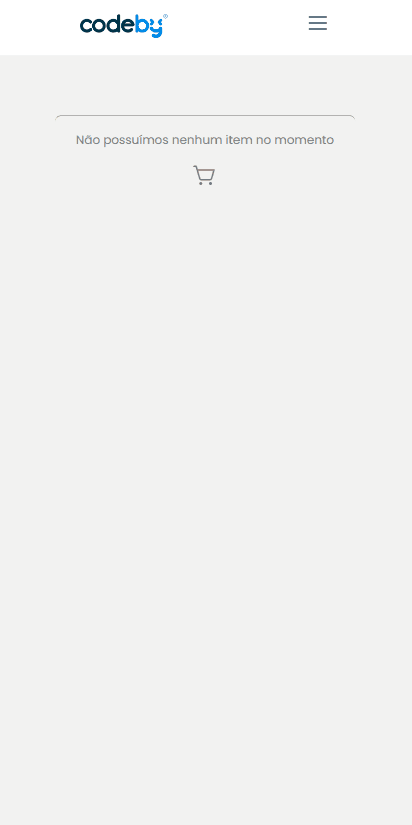

    

<h1 align="center" >CodeBy Shopping Cart</h1 >

<h2 style="" >Tabela de Conteúdo</h2>

<ul>
   <li><a href="#tabela">Tabela de Conteúdo</a></li>
   <li><a href="#sobre">Sobre</a></li>
   <li><a href="#tecnologias">Tecnologias</a></li>
   <li><a href="#requisitos">Requisitos</a></li>
   <li><a href="#lincec-a">Licença</a></li>
   <li><a href="#autor">Autor</a></li>
   <li><a href="#contato">Contato</a></li>
</ul>

 

# Sobre

Esse projeto foi desenvolvido para o processo seletivo da <a href="https://codeby.global/">Codeby Brasil</a> para a vaga de desenvolvedor júnior, ele se resume em um carrinho de compras de determinados produtos. Nele é listado todos os produtos pertinentes a dois carrinhos com preços de compra final diferentes, onde o valor acima de 10 disponibiliza frete grátis e a mensagem é apresentada ao usuário, os dados são listados a partir de uma api em JSON que foi disponibilizado pela empresa. Por último ressaltar que o sistema foi desenvolvido com responsividade.

 <a href="https://codeby-test-final.herokuapp.com/">Click Aqui para acessar a alicação</a> 

 

# Tecnologias

<ul>
   <li>
    <a href="https://create-react-app.dev/">React Create App</a>
     
   </li>
   <li>
        <a href="https://www.typescriptlang.org/">TypeScript</a>
        
   </li>
   <li>
    <a href="https://www.npmjs.com/">Npm</a>
    
</ul>

 

# Requisitos

<ul>
   <li>Possuir Node.js versão LTS instalada</li>
   <li>Possuir NPM instalado (normalmente vem junto ao node.js)</li>
   <li>Executar o comando de <strong>npm install</strong> para instalar todas as dependências do projeto</li>
   <li>Executar o comando de <strong>npm run dev</strong> para inicializar a aplicação</li>
</ul>