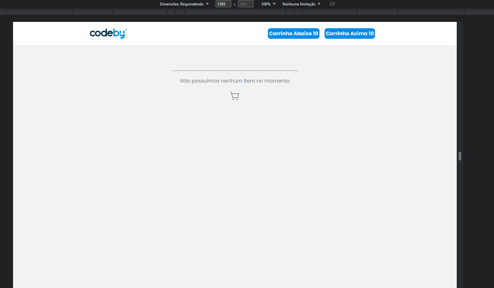

    

<h1 align="center" >CodeBy Shopping Cart</h1 >

<h2 style="" >Tabela de Conteúdo - Table of Contents</h2>

<ul>
   <li><a href="#tabela">Tabela de Conteúdo - Table of Contents</a></li>
   <li><a href="#sobre">Sobre - About</a></li>
   <li><a href="#demonstração">Demonstração - Demonstration</a></li>
   <li><a href="#tecnologias">Tecnologias - Technologies</a></li>
   <li><a href="#requisitos">Requisitos - Requirements</a></li>
   <li><a href="#licença">Licença - License</a></li>
   <li><a href="#autor">Autor - Author</a></li>
   <li><a href="#contato">Contato - Contact</a></li>
</ul>

 

# Sobre / About

This project was developed for the selection process of <a target="_blank" href="https://codeby.global/">Codeby Brasil</a> for the junior developer vacancy, it boils down to a shopping cart of certain products. It lists all products relevant to two carts with different final purchase prices, where the value above 10 provides free shipping and the message is presented to the user, the data is listed from an api in JSON that was made available by the company . Finally, it should be noted that the system was developed with responsiveness.

---------------------------------------------------------------

Esse projeto foi desenvolvido para o processo seletivo da <a target="_blank" href="https://codeby.global/">Codeby Brasil</a> para a vaga de desenvolvedor júnior, ele se resume em um carrinho de compras de determinados produtos. Nele é listado todos os produtos pertinentes a dois carrinhos com preços de compra final diferentes, onde o valor acima de 10 disponibiliza frete grátis e a mensagem é apresentada ao usuário, os dados são listados a partir de uma api em JSON que foi disponibilizado pela empresa. Por último ressaltar que o sistema foi desenvolvido com responsividade.

 <a target="_blank" href="https://codeby-test-final.herokuapp.com/">Click Aqui para acessar a alicação</a> 

# Demonstração / Demonstration

 

Responsividade / Responsiveness

 

# Tecnologias / Technologies

<ul>
   <li>
    <a target="_blank" href="https://create-react-app.dev/">React Create App</a>
     
   </li>
   <li>
        <a  target="_blank"href="https://www.typescriptlang.org/">TypeScript</a>
        
   </li>
   <li>
    <a target="_blank" href="https://www.npmjs.com/">Npm</a>
    
</ul>

 

# Requisitos / Requirements

<ul>
  
      <li>Have Node.js LTS version installed</li>
   <li>Have NPM installed (usually comes bundled with node.js)</li>
   <li>Follow the steps below</li>
    ----------------------------------------
   <li>Possuir Node.js versão LTS instalada</li>
   <li>Possuir NPM instalado (normalmente vem junto ao node.js)</li>
   <li>Seguir os passos abaixo</li>
   
  

      #clone este repositório - clone this repository
      $ git clone <https://github.com/montanari2019/codeby-test-final.git>

      # Acesse a pasta do projeto no terminal/cmd  - Access project folder in terminal/cmd
      $ cd codeby-test-final

      # Instale as dependências com o comando - Install the dependencies with the command
      $ npm install

      # Execute a aplicação em modo de desenvolvimento - Run the application in development mode
      $ npm run dev 

      # Servidor ira executar na porta:3000 - acesse <http://localhost:3000/>

</ul>

# Licença / License

Distribuído sob a licença MIT. Veja <code>LICENSE</code> para mais informações.

# Autor / Author

    
    
Ikaro Montanari, tech enthusiast and front-end developer

Graduated in Systems Analysis and Development by IFRO in Vilhena-RO

Front-end Web Developer at Mirian Posts, in the fuel sector

---------------------------------------------

Ikaro Montanari, entusiasta por tecnologia e desenvolvedor front-end

Formado em Análie e Desenvolvimento de Sistemas pelo IFRO em Vilhena-RO

Desenvolvedor Web Front-end nos Postos Mirian

# Contato / Contact

Linkedin <a target="_blank" href="https://www.linkedin.com/in/ikaro-montanari-5aa120208/">Ikaro Montanari</a> 

Instagram  <a target="_blank" href="https://www.instagram.com/ikaro.montanari/">@ikaro_montanari</a> 

Telefone <a target="_blank" href="https://api.whatsapp.com/send?phone=5569993569547&text=Ol%C3%A1%20ikaro">(69) 99356-9547</a> 

